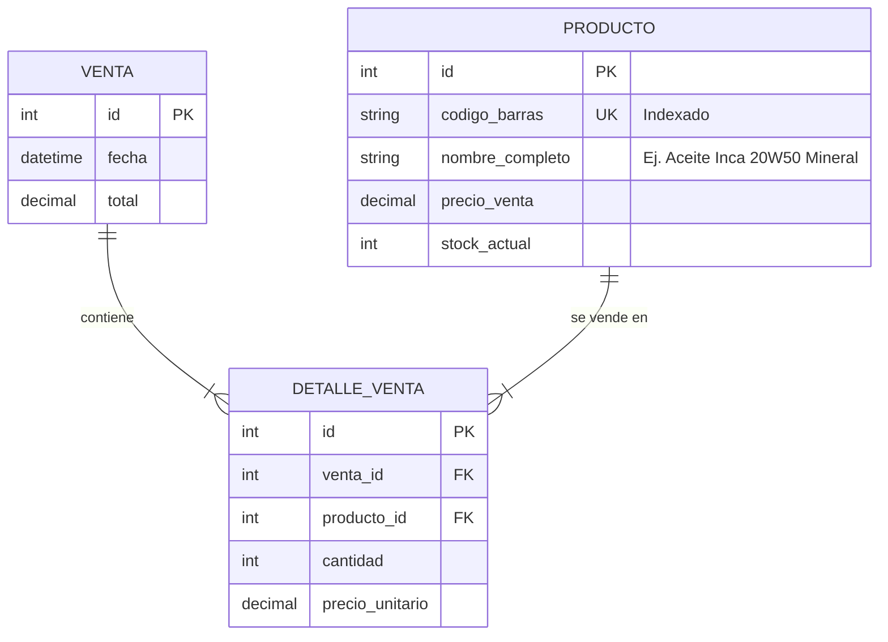

# Ruta 8 Autopartes - Sistema POS e Inventario Local

Este es el sistema local y offline de Punto de Venta (POS) e Inventario diseñado a medida para **Ruta 8 Autopartes**, un negocio de aceites, lubricantes y repuestos.

El sistema está optimizado para ejecutarse en una PC con **Ubuntu**, diseñado para funcionar completamente sin conexión a internet, mantener protegidas las operaciones del negocio con un login simple, y recibir lecturas directas desde un **lector de códigos de barra USB** (el cual emula la entrada de un teclado físico).

---

## 🛠️ Requisitos Previos

- **Docker** y **Docker Compose** (Recomendado para evitar instalar dependencias de desarrollo en el host).
- Alternativamente, si se ejecuta sin contenedores:
  - **Python 3.10+** y `pip` / `venv`.
  - **Node.js 18+** y `npm`.

---

## 🚀 Inicio Rápido (Con Docker - Recomendado)

Dado que todo el entorno está contenedorizado, puedes levantar la aplicación completa (Base de datos SQLite persistente, API de Django y Frontend React servido con Nginx) con un solo comando.

1. Abre una terminal en la raíz del proyecto.
2. Ejecuta el siguiente comando para compilar e iniciar los servicios:
   ```bash
   docker compose up --build
   ```
3. El sistema estará disponible en:
   - **Frontend (POS UI)**: [http://localhost](http://localhost) (Puerto 80 estándar)
   - **Backend API**: [http://localhost:8000](http://localhost:8000)
   - **Panel de Administración de Django**: [http://localhost:8000/admin/](http://localhost:8000/admin/)

> [!IMPORTANT]
> La base de datos SQLite se crea en `backend/db.sqlite3` en tu máquina local gracias a los volúmenes de Docker. Tu información no se perderá al detener o reconstruir los contenedores.

### Cargar Semilla de Datos y Crear Administrador en Docker
Para poblar la base de datos con algunos aceites/filtros de prueba y dar de alta la cuenta de operador por defecto, ejecuta en otra terminal:
```bash
docker compose run --rm backend python seed.py
```

---

## 🔑 Credenciales de Acceso por Defecto
Al iniciar el sistema en el navegador, se presentará una pantalla de acceso. Puedes ingresar con el siguiente usuario único configurado para la administración local:
- **Usuario**: `ruta8`
- **Contraseña**: `adminruta8`

---

## 💻 Desarrollo Local (Sin Docker)

Si prefieres ejecutar el software directamente en tu máquina de desarrollo, sigue estos pasos:

### 1. Servidor Backend (Django)
1. Dirígete a la carpeta del backend:
   ```bash
   cd backend
   ```
2. Crea e inicia un entorno virtual:
   ```bash
   python3 -m venv .venv
   source .venv/bin/activate
   ```
3. Instala las dependencias:
   ```bash
   pip install -r requirements.txt
   ```
4. Genera y aplica las migraciones de base de datos:
   ```bash
   python manage.py makemigrations inventario
   python manage.py migrate
   ```
5. *(Opcional)* Carga los productos semilla y crea el administrador:
   ```bash
   python seed.py
   ```
6. Inicia el servidor de desarrollo:
   ```bash
   python manage.py runserver
   ```
   El backend se ejecutará en `http://127.0.0.1:8000/`.

### 2. Frontend (React + Vite)
1. Dirígete a la carpeta del frontend:
   ```bash
   cd frontend
   ```
2. Instala los módulos de Node.js:
   ```bash
   npm install
   ```
3. Inicia el servidor de desarrollo:
   ```bash
   npm run dev
   ```
   El POS se abrirá en `http://localhost:5173/`.

---

## 🗄️ Diseño Simplificado de Base de Datos

El diseño de la base de datos se mantiene extremadamente simple para el usuario final. Los productos se manejan como **unidades cerradas/envases** (sin importar la presentación en litros o cajas):



### Reglas de Negocio en Venta:
- Al registrar una venta, la base de datos ejecuta una transacción atómica (`transaction.atomic()`).
- Se bloquean las filas del producto consultado (`select_for_update()`) para evitar condiciones de carrera si se procesan varias ventas rápidamente.
- Si el stock es insuficiente, la venta se cancela en su totalidad y se devuelve un error de validación `400 Bad Request`.

---

## 🔌 Lector de Código de Barras USB y Flujo de Trabajo

1. **Autenticación Obligatoria**: El operador inicia sesión con el usuario `ruta8`. El frontend guarda localmente un token de autenticación que adjunta en el encabezado `Authorization: Token <key>` de cada petición HTTP.
2. **Lectura Directa**: En la vista de venta, el frontend (`POS.jsx`) mantiene un input invisible enfocado permanentemente mediante `React.useRef`. Al pasar el lector USB sobre un producto, este escribe el código de barras y envía un evento `Enter` automáticamente.
3. **Búsqueda Automatizada**: Al presionar `Enter`, el sistema consulta al backend en busca del código de barras. Si el producto existe:
   - Se añade al carrito con cantidad `1`.
   - Si ya estaba en el carrito, se suma `1` a la cantidad (verificando el stock disponible).
4. **Navegación Simple**: Un menú superior con botones de pestañas permite alternar de forma segura entre el **Punto de Venta** (pantalla del mostrador) y el **Catálogo / Inventario**.
5. **Administración de Inventario**: En la sección de catálogo, el usuario puede buscar productos por descripción o código de barras, actualizar precios o niveles de existencias al instante seleccionándolos para su edición, o dar de alta productos nuevos de forma rápida.

---

## 📊 Integración del Webhook n8n (Cierre de Caja)

El sistema cuenta con un botón en la interfaz de venta llamado **Cierre de Caja**. Al ser presionado:
1. Agrupa las ventas concretadas en el día en curso.
2. Calcula el monto total acumulado y la cantidad de envases vendidos.
3. Genera un desglose detallado por producto.
4. Envía la información al webhook n8n configurado en la variable `N8N_WEBHOOK_URL` de tu entorno.

**Payload JSON enviado a n8n:**
```json
{
  "fecha": "2026-06-12",
  "monto_acumulado": 1250.00,
  "productos_vendidos_count": 8,
  "desglose_productos": [
    {
      "codigo_barras": "7501234567890",
      "nombre_completo": "Aceite Inca 20W50 Mineral 1L",
      "cantidad_vendida": 5,
      "monto_generado": 750.00
    },
    {
      "codigo_barras": "7501234567892",
      "nombre_completo": "Filtro de Aceite Millard ML-3614",
      "cantidad_vendida": 3,
      "monto_generado": 255.00
    }
  ]
}
```
